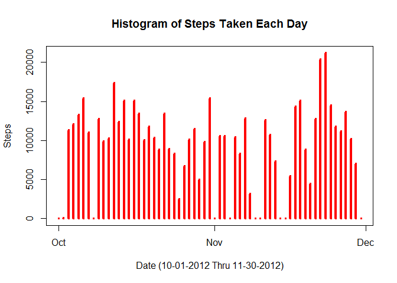
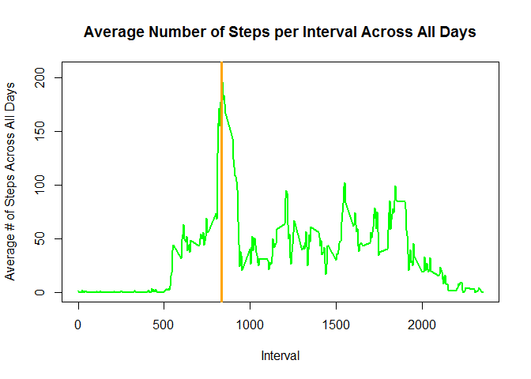
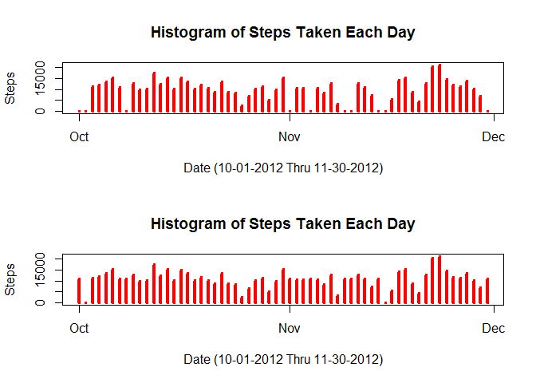
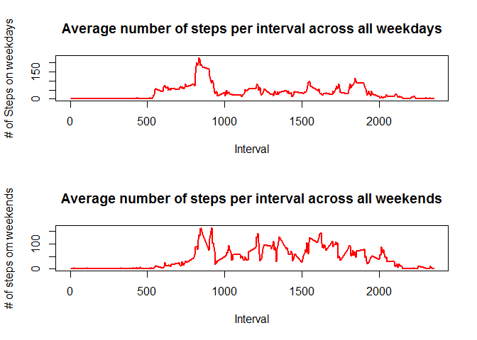

# Reproducible Research: Peer Assessment 1
Karen Linden  
Sunday, June 14, 2015  
    
---

opts_chunk$set(echo=TRUE, results='asis')

## Loading and preprocessing the data

Read in the data.


```r
setwd('~/R/ReproducibleResearchProject1')

if(!file.exists('activity.csv')){
        unzip('repdata-data-activity.zip')
}

data.file <- read.csv("activity.csv") # Read in data file
```

Create a date.time column that combines the date and interval columns. Ended up not needs this field


```r
time.fix <- formatC(data.file$interval / 100, 2, format='f')
data.file$date.time <- as.POSIXct(paste(data.file$date, time.fix),
                                 format='%Y-%m-%d %H.%M',
                                 tz='GMT')
```

For analyzing the convenient date file To do this it will help us with the analysis.


```r
date.fix <- strptime(data.file$date, "%Y-%m-%d")
data.file$date.update <- date.fix
```

unique.dates and unique.intervals, they are variables that store a list of all possible dates and intervals. These will primarily be used to help plot our necessary data and for data processing.


```r
unique.dates <- unique(date.fix)
unique.intervals <- unique(data.file$interval)
```

## What is mean total number of steps taken per day?

First, calculate the mean number of steps for each day:


```r
steps.by.day <- split(data.file$steps, date.fix$yday)
steps.per.day <- sapply(steps.by.day, sum, na.rm=TRUE)
```
Mean and median for the total steps per day:


```r
mean.stepsperday <- sapply(steps.by.day, mean, na.rm=TRUE)
mean.dataframe <- data.frame(date=unique.dates, mean.stepsperday=mean.stepsperday, row.names=NULL)
mean.dataframe
```

```
##          date mean.stepsperday
## 1  2012-10-01              NaN
## 2  2012-10-02        0.4375000
## 3  2012-10-03       39.4166667
## 4  2012-10-04       42.0694444
## 5  2012-10-05       46.1597222
## 6  2012-10-06       53.5416667
## 7  2012-10-07       38.2465278
## 8  2012-10-08              NaN
## 9  2012-10-09       44.4826389
## 10 2012-10-10       34.3750000
## 11 2012-10-11       35.7777778
## 12 2012-10-12       60.3541667
## 13 2012-10-13       43.1458333
## 14 2012-10-14       52.4236111
## 15 2012-10-15       35.2048611
## 16 2012-10-16       52.3750000
## 17 2012-10-17       46.7083333
## 18 2012-10-18       34.9166667
## 19 2012-10-19       41.0729167
## 20 2012-10-20       36.0937500
## 21 2012-10-21       30.6284722
## 22 2012-10-22       46.7361111
## 23 2012-10-23       30.9652778
## 24 2012-10-24       29.0104167
## 25 2012-10-25        8.6527778
## 26 2012-10-26       23.5347222
## 27 2012-10-27       35.1354167
## 28 2012-10-28       39.7847222
## 29 2012-10-29       17.4236111
## 30 2012-10-30       34.0937500
## 31 2012-10-31       53.5208333
## 32 2012-11-01              NaN
## 33 2012-11-02       36.8055556
## 34 2012-11-03       36.7048611
## 35 2012-11-04              NaN
## 36 2012-11-05       36.2465278
## 37 2012-11-06       28.9375000
## 38 2012-11-07       44.7326389
## 39 2012-11-08       11.1770833
## 40 2012-11-09              NaN
## 41 2012-11-10              NaN
## 42 2012-11-11       43.7777778
## 43 2012-11-12       37.3784722
## 44 2012-11-13       25.4722222
## 45 2012-11-14              NaN
## 46 2012-11-15        0.1423611
## 47 2012-11-16       18.8923611
## 48 2012-11-17       49.7881944
## 49 2012-11-18       52.4652778
## 50 2012-11-19       30.6979167
## 51 2012-11-20       15.5277778
## 52 2012-11-21       44.3993056
## 53 2012-11-22       70.9270833
## 54 2012-11-23       73.5902778
## 55 2012-11-24       50.2708333
## 56 2012-11-25       41.0902778
## 57 2012-11-26       38.7569444
## 58 2012-11-27       47.3819444
## 59 2012-11-28       35.3576389
## 60 2012-11-29       24.4687500
## 61 2012-11-30              NaN
```

```r
median.stepsperday <- sapply(steps.by.day, median, na.rm=TRUE)
median.dataframe <- data.frame(date=unique.dates, median.stepsperday=median.stepsperday, row.names=NULL)
median.dataframe
```

```
##          date median.stepsperday
## 1  2012-10-01                 NA
## 2  2012-10-02                  0
## 3  2012-10-03                  0
## 4  2012-10-04                  0
## 5  2012-10-05                  0
## 6  2012-10-06                  0
## 7  2012-10-07                  0
## 8  2012-10-08                 NA
## 9  2012-10-09                  0
## 10 2012-10-10                  0
## 11 2012-10-11                  0
## 12 2012-10-12                  0
## 13 2012-10-13                  0
## 14 2012-10-14                  0
## 15 2012-10-15                  0
## 16 2012-10-16                  0
## 17 2012-10-17                  0
## 18 2012-10-18                  0
## 19 2012-10-19                  0
## 20 2012-10-20                  0
## 21 2012-10-21                  0
## 22 2012-10-22                  0
## 23 2012-10-23                  0
## 24 2012-10-24                  0
## 25 2012-10-25                  0
## 26 2012-10-26                  0
## 27 2012-10-27                  0
## 28 2012-10-28                  0
## 29 2012-10-29                  0
## 30 2012-10-30                  0
## 31 2012-10-31                  0
## 32 2012-11-01                 NA
## 33 2012-11-02                  0
## 34 2012-11-03                  0
## 35 2012-11-04                 NA
## 36 2012-11-05                  0
## 37 2012-11-06                  0
## 38 2012-11-07                  0
## 39 2012-11-08                  0
## 40 2012-11-09                 NA
## 41 2012-11-10                 NA
## 42 2012-11-11                  0
## 43 2012-11-12                  0
## 44 2012-11-13                  0
## 45 2012-11-14                 NA
## 46 2012-11-15                  0
## 47 2012-11-16                  0
## 48 2012-11-17                  0
## 49 2012-11-18                  0
## 50 2012-11-19                  0
## 51 2012-11-20                  0
## 52 2012-11-21                  0
## 53 2012-11-22                  0
## 54 2012-11-23                  0
## 55 2012-11-24                  0
## 56 2012-11-25                  0
## 57 2012-11-26                  0
## 58 2012-11-27                  0
## 59 2012-11-28                  0
## 60 2012-11-29                  0
## 61 2012-11-30                 NA
```
Look at the distribution of total number of steps per day with a histogram:


```r
plot(unique.dates, 
     steps.per.day, 
     main="Histogram of Steps Taken Each Day", 
     xlab="Date (10-01-2012 Thru 11-30-2012)", 
     ylab="Steps", 
     type="h", 
     lwd=4, 
     col="red")
```

 

## What is the average daily activity pattern?

Calculate the mean steps for each five minute interval, and then put it in a data frame.


```r
interval.split <- split(data.file$steps, data.file$interval)

average.interval <- sapply(interval.split, mean, na.rm=TRUE)
```

Let's take a look at a time series plot for the mean steps.


```r
plot(unique.intervals, average.interval, 
     type="l",
     main="Average Number of Steps per Interval Across All Days", 
     xlab="Interval", 
     ylab="Average # of Steps Across All Days", 
     lwd=2, 
     col="green")

max.interval.day <- max(average.interval, na.rm=TRUE)
max.index <- as.numeric(which(average.interval == max.interval.day))


max.Interval <- unique.intervals[max.index]
abline(v=max.Interval , col="orange", lwd=3)
```

 
The maximum number of steps averaged across all days is:


```r
max.Interval
```

```
## [1] 835
```

## Imputing missing values

Identify the number of intervals with missing step counts ("NA's"):


```r
missing.steps <- is.na(data.file$steps)
# How many missing
table(missing.steps)
```

```
## missing.steps
## FALSE  TRUE 
## 15264  2304
```

To fill in the missing values, I'll use mean steps for a five-minute interval for the entire dataset.


```r
library(Hmisc)
```

```
## Warning: package 'Hmisc' was built under R version 3.1.3
```

```
## Loading required package: grid
## Loading required package: lattice
## Loading required package: survival
## Loading required package: splines
## Loading required package: Formula
```

```
## Warning: package 'Formula' was built under R version 3.1.3
```

```
## Loading required package: ggplot2
```

```
## Warning: package 'ggplot2' was built under R version 3.1.3
```

```
## 
## Attaching package: 'Hmisc'
## 
## The following objects are masked from 'package:base':
## 
##     format.pval, round.POSIXt, trunc.POSIXt, units
```

```r
averages <- aggregate(x=list(steps=data.file$steps), by=list(interval=data.file$interval),
                                             FUN=mean, na.rm=TRUE)

fill.value <- function(steps, interval) {
        filled <- NA
        if (!is.na(steps))
                filled <- c(steps)
        else
                filled <- (averages[averages$interval==interval, "steps"])
        return(filled)
}
fill.data <- data.file
fill.data$steps <- mapply(fill.value, fill.data$steps, fill.data$interval)
```

Compare the mean and median steps for each day between the original data set and the imputed data set.


```r
newsteps.by.day <- split(fill.data$steps, date.fix$yday)
newsteps.per.day <- sapply(newsteps.by.day, sum)
```

And a histogram of the imputed dataset.

```r
par(mfcol=c(2,1))


plot(unique.dates, 
     steps.per.day, 
     main="Histogram of Steps Taken Each Day", 
     xlab="Date (10-01-2012 Thru 11-30-2012)", 
     ylab="Steps", 
     type="h", 
     lwd=4, 
     col="red")

# Plot the modified histogram after

plot(unique.dates, 
     newsteps.per.day, 
     main="Histogram of Steps Taken Each Day", 
     xlab="Date (10-01-2012 Thru 11-30-2012)", 
     ylab="Steps", 
     type="h", 
     lwd=4, 
     col="red")
```

 

Mean and median for the total steps per day:


```r
newmean.stepsperday <- sapply(newsteps.by.day, mean, na.rm=TRUE)
newmean.dataframe <- data.frame(date=unique.dates, newmean.stepsperday=newmean.stepsperday, row.names=NULL)
newmean.dataframe
```

```
##          date newmean.stepsperday
## 1  2012-10-01          37.3825996
## 2  2012-10-02           0.4375000
## 3  2012-10-03          39.4166667
## 4  2012-10-04          42.0694444
## 5  2012-10-05          46.1597222
## 6  2012-10-06          53.5416667
## 7  2012-10-07          38.2465278
## 8  2012-10-08          37.3825996
## 9  2012-10-09          44.4826389
## 10 2012-10-10          34.3750000
## 11 2012-10-11          35.7777778
## 12 2012-10-12          60.3541667
## 13 2012-10-13          43.1458333
## 14 2012-10-14          52.4236111
## 15 2012-10-15          35.2048611
## 16 2012-10-16          52.3750000
## 17 2012-10-17          46.7083333
## 18 2012-10-18          34.9166667
## 19 2012-10-19          41.0729167
## 20 2012-10-20          36.0937500
## 21 2012-10-21          30.6284722
## 22 2012-10-22          46.7361111
## 23 2012-10-23          30.9652778
## 24 2012-10-24          29.0104167
## 25 2012-10-25           8.6527778
## 26 2012-10-26          23.5347222
## 27 2012-10-27          35.1354167
## 28 2012-10-28          39.7847222
## 29 2012-10-29          17.4236111
## 30 2012-10-30          34.0937500
## 31 2012-10-31          53.5208333
## 32 2012-11-01          37.3825996
## 33 2012-11-02          36.8055556
## 34 2012-11-03          36.7048611
## 35 2012-11-04          37.3825996
## 36 2012-11-05          36.2465278
## 37 2012-11-06          28.9375000
## 38 2012-11-07          44.7326389
## 39 2012-11-08          11.1770833
## 40 2012-11-09          37.3825996
## 41 2012-11-10          37.3825996
## 42 2012-11-11          43.7777778
## 43 2012-11-12          37.3784722
## 44 2012-11-13          25.4722222
## 45 2012-11-14          37.3825996
## 46 2012-11-15           0.1423611
## 47 2012-11-16          18.8923611
## 48 2012-11-17          49.7881944
## 49 2012-11-18          52.4652778
## 50 2012-11-19          30.6979167
## 51 2012-11-20          15.5277778
## 52 2012-11-21          44.3993056
## 53 2012-11-22          70.9270833
## 54 2012-11-23          73.5902778
## 55 2012-11-24          50.2708333
## 56 2012-11-25          41.0902778
## 57 2012-11-26          38.7569444
## 58 2012-11-27          47.3819444
## 59 2012-11-28          35.3576389
## 60 2012-11-29          24.4687500
## 61 2012-11-30          37.3825996
```

```r
newmedian.stepsperday <- sapply(newsteps.by.day, median, na.rm=TRUE)
newmedian.dataframe <- data.frame(date=unique.dates, newmedian.stepsperday=newmedian.stepsperday, row.names=NULL)
newmedian.dataframe
```

```
##          date newmedian.stepsperday
## 1  2012-10-01              34.11321
## 2  2012-10-02               0.00000
## 3  2012-10-03               0.00000
## 4  2012-10-04               0.00000
## 5  2012-10-05               0.00000
## 6  2012-10-06               0.00000
## 7  2012-10-07               0.00000
## 8  2012-10-08              34.11321
## 9  2012-10-09               0.00000
## 10 2012-10-10               0.00000
## 11 2012-10-11               0.00000
## 12 2012-10-12               0.00000
## 13 2012-10-13               0.00000
## 14 2012-10-14               0.00000
## 15 2012-10-15               0.00000
## 16 2012-10-16               0.00000
## 17 2012-10-17               0.00000
## 18 2012-10-18               0.00000
## 19 2012-10-19               0.00000
## 20 2012-10-20               0.00000
## 21 2012-10-21               0.00000
## 22 2012-10-22               0.00000
## 23 2012-10-23               0.00000
## 24 2012-10-24               0.00000
## 25 2012-10-25               0.00000
## 26 2012-10-26               0.00000
## 27 2012-10-27               0.00000
## 28 2012-10-28               0.00000
## 29 2012-10-29               0.00000
## 30 2012-10-30               0.00000
## 31 2012-10-31               0.00000
## 32 2012-11-01              34.11321
## 33 2012-11-02               0.00000
## 34 2012-11-03               0.00000
## 35 2012-11-04              34.11321
## 36 2012-11-05               0.00000
## 37 2012-11-06               0.00000
## 38 2012-11-07               0.00000
## 39 2012-11-08               0.00000
## 40 2012-11-09              34.11321
## 41 2012-11-10              34.11321
## 42 2012-11-11               0.00000
## 43 2012-11-12               0.00000
## 44 2012-11-13               0.00000
## 45 2012-11-14              34.11321
## 46 2012-11-15               0.00000
## 47 2012-11-16               0.00000
## 48 2012-11-17               0.00000
## 49 2012-11-18               0.00000
## 50 2012-11-19               0.00000
## 51 2012-11-20               0.00000
## 52 2012-11-21               0.00000
## 53 2012-11-22               0.00000
## 54 2012-11-23               0.00000
## 55 2012-11-24               0.00000
## 56 2012-11-25               0.00000
## 57 2012-11-26               0.00000
## 58 2012-11-27               0.00000
## 59 2012-11-28               0.00000
## 60 2012-11-29               0.00000
## 61 2012-11-30              34.11321
```

Imputing the missing data has increased the average number of steps.


## Are there differences in activity patterns between weekdays and weekends?

Add a column for whether a day is a weekday or weekend.


```r
dayofweek <- function(date) {
        day <- weekdays(date)
        if (day %in% c("Monday", "Tuesday", "Wednesday", "Thursday", "Friday"))
                return("weekday")
        else if (day %in% c("Saturday", "Sunday"))
                return("weekend")
        else
                stop("invalid date")
}

fill.date <- fill.data 
fill.date$date <- as.Date(fill.data$date)
fill.date$dayofweek <- sapply(fill.date$date, FUN=dayofweek)
```


```r
weekday <- fill.date[fill.date$dayofweek == "weekday", ]
weekend <- fill.date[fill.date$dayofweek == "weekend", ]

weekday.split <- split(weekday$steps, weekday$interval)
weekend.split <- split(weekend$steps, weekend$interval)

mean.weekday.split <- sapply(weekday.split, mean)
mean.weekend.split <- sapply(weekend.split, mean)
```
Compare the patterns between weekdays and weekends.


```r
par(mfcol=c(2,1))

plot(unique.intervals, 
     mean.weekday.split, 
     type="l",
     main="Average number of steps per interval across all weekdays", 
     xlab="Interval", 
     ylab="# of Steps on weekdays", 
     lwd=2, 
     col="red")

plot(unique.intervals, 
     mean.weekend.split, 
     type="l",
     main="Average number of steps per interval across all weekends", 
     xlab="Interval", 
     ylab="# of steps om weekends", 
     lwd=2, 
     col="red")
```

 
